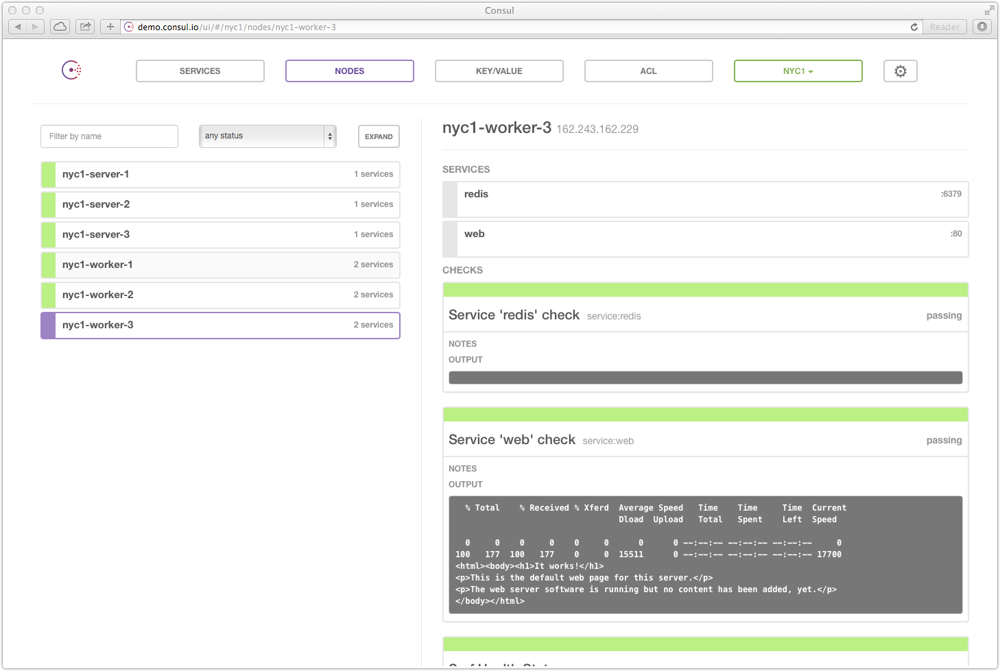

# WEB界面

Consul同时提供了一个漂亮的功能齐全的WEB界面,开箱即用.界面可以用来查看所有的节点,可以查看健康检查和他们的当前状态.可以读取和设置K/V 存储的数据.UI自动支持多数据中心.

运行WebUI有两个选项.使用HashiCorp提供的Atlas来托管你的仪表盘或者使用Consul自己托管的开源UI

## Atlas托管的仪表盘


为了设置Consul使用Atlas界面.你必须添加两个字段到你的配置文件:你的Atlas名称和TOKEN.下面是一个命令行示例用来配置agent的这些设置:

```
$ consul agent -atlas=ATLAS_USERNAME/demo -atlas-token="ATLAS_TOKEN"
```
获取Atlas用户名和token,[创建](https://atlas.hashicorp.com/account/new)一个账号并替换成你自己的配置.你可以查看线上[Demo](https://atlas.hashicorp.com/hashicorp/environments/consul-demo).

## Consul托管的仪表盘



设置自托管的UI服务,启动Consul时使用```-ui``` 参数:

```
[root@hdp4 ~]# consul agent -ui
```

UI的路径在 ```ui```,使用HTTP API 相同的端口.默认为 ```http://localhost:8500/ui```.

>
> 译者注: ```-client```指定你要将HTTP绑定到的IP,绑定到一个公网IP一边可以从外部访问,否则只能在本机进行访问.所以我的启动命令是
> ```[root@hdp4 ~]# consul agent -ui -data-dir /tmp/consul -bind 10.0.0.54 -join 10.0.0.52```
>

你可以查看线上[Demo](http://demo.consul.io/).

线上Demo可以访问所有的数据中心.我们也设置了Demo的端点: AMS2 (阿姆斯特丹) , SF01(旧金山) 和 NY3(纽约).

## 下一步

我们的入门指南完成了.查看下一页来了解如何继续你与Consul的旅程!